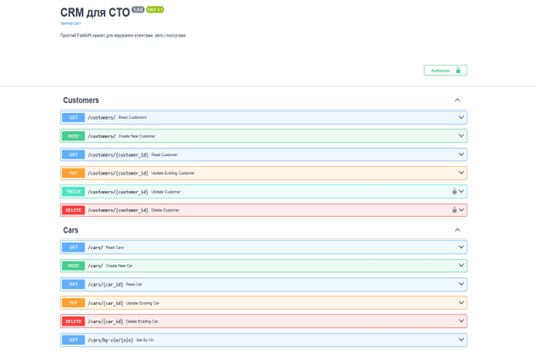
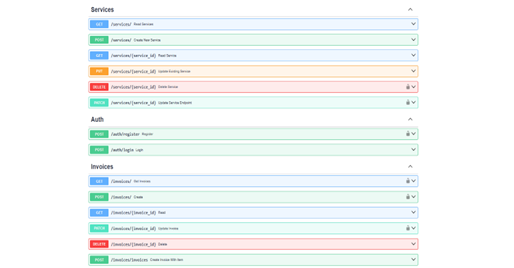
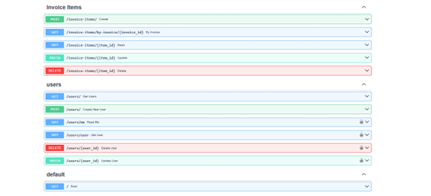

# CRM-система для СТО (Car Service CRM)

Проєкт розроблено в рамках виконання лабораторних робіт з курсі "Архітектура ПЗ".
Система призначена для автоматизації процесів обслуговування клієнтів на СТО.

## 🛠 Технологічний стек
* **Backend:** Python 3.10 + FastAPI
* **Frontend:** React.js + Vite
* **Database:** PostgreSQL 15
* **Infrastructure:** Docker & Docker Compose

## 🚀 Як запустити проєкт
Для швидкого розгортання використовується Docker.

1.  **Запустіть проєкт:**
    ```bash
    docker-compose up -d --build
    ```

## 🌐 Доступ до сервісів
Після успішного запуску контейнерів:

* **Frontend (Інтерфейс користувача):** 👉 [http://localhost:5173](http://localhost:5173)
    *Тут можна переглядати список клієнтів/авто та додавати нові записи.*

* **Backend API (Swagger UI):** 👉 [http://localhost:8000/docs](http://localhost:8000/docs)
    *Інтерактивна документація для тестування ендпоінтів.*

---

## 📑 API Документація (Практична 4)
Згідно з вимогами, розроблено контракт API у форматі OpenAPI (Contract First).

* 📄 **OpenAPI Специфікація:** [docs/api/openapi.yaml](docs/api/openapi.yaml) 

  * 📸 **Візуалізація (Swagger Editor):**
  
    
    
*   
---

## 📚 Проєктна документація
Вся документація по проєкту знаходиться в папці `docs/`:

* **Бізнес-аналіз:** [docs/business_doc.md](docs/business_doc.md) (Вимоги, Ролі, Сценарії) 
* **Архітектура:** [docs/architecture_diagram.png](docs/architecture_diagram.png) 
* **Roadmap:** [docs/roadmap.md](docs/roadmap.md) (План розвитку) 
* **DDD (Domain Driven Design):** [docs/domain/](docs/domain/) (Глосарій, Сутності, Context Map) 
* **ADR (Architectural Decision Records):** [docs/adr/](docs/adr/) (Фіксація архітектурних рішень) 

---

## 📋 Реалізація вимог (Log)

### ✅ Практична 1. Базовий клієнт – бекенд – БД
* Реалізовано зв'язок Frontend -> Backend REST API -> PostgreSQL.
* Сервер на FastAPI з реалізованими CRUD операціями.

### ✅ Практична 2. Бізнес-документ і архітектура
* Сформовано бізнес-вимоги та Roadmap.
* Налаштовано Git Flow (Fork -> Pull Request).

### ✅ Практична 3. Domain-Driven Design (DDD)
* Виділено піддомени (CRM, Service Operations, Billing).
* Створено прототипи доменних моделей.

### ✅ Практична 4. Мікросервіси та Контракт API
* Обрано архітектурний стиль: **Модульний Моноліт** (зафіксовано в ADR-0001).
* Реалізовано шарувату архітектуру: `API` -> `Service (CRUD)` -> `Domain` (зафіксовано в ADR-0002)[.
* Описано контракт API (`openapi.yaml`) та реалізовано валідацію через Pydantic.

---

## 👥 Команда
* **Backend / DevOps:** Кущ А.Д.
* **Frontend:** Войтович М. А.